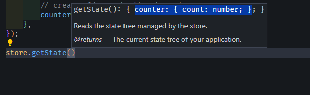

# Redux

- library make state management

> Redux is most useful when your application state grows in **size** and **complexity**.

- If the data is **small and localized**, React Context or local state is usually enough.
- If the data is **large, shared, and complex**, Redux (especially with Redux Toolkit) provides better structure, scalability, and maintainability.

```bash
# NPM
npm install @reduxjs/toolkit
# If you use npm:
npm install react-redux
```

1. in `src` create folder name `redux`

- in folder create file name `store.ts`

  - In `store.ts` we will create store and configure it with `configureStore` from `@reduxjs/toolkit`
  - configureStore` takes a reducer as an argument and returns a store

  ```ts
  const store = configureStore({
    reducer: {
      // Add your reducers here
    },
  });
  ```

  - > In Layout add provider take from `react-redux` and pass store to it
  - provider take store as a prop and wrap your app with it

````tsx
export default function RootLayout({
  children,
}: Readonly<{
  children: React.ReactNode;
}>) {
  return (
    <html lang="en">
      <body
        className={`${geistSans.variable} ${geistMono.variable} antialiased`}
      >
          <ProviderContainer>
            <Navbar />
            {children}
          </ProviderContainer>
          <Toaster />
          <Footer />
      </body>
    </html>
  );
}
    ```
````

- now i make a providerContainer

```tsx
'use client';
import CartContextProvider from '@/contexts/CartContext';
import { store } from '@/redux/store';
import React from 'react';
import { Provider } from 'react-redux';

export default function ProviderContainer({
  children,
}: {
  children: React.ReactNode;
}) {
  return (
    <Provider store={store}>
      {' '}
      <CartContextProvider>{children}</CartContextProvider>{' '}
    </Provider>
  );
}
```

- found error in console

```bash
hook.js:608  Store does not have a valid reducer. Make sure the argument passed to combineReducers is an object whose values are reducers.
```

- must make a reducer now can you slice
- create folder name slice and create you slices here
- now i create `CounterSlice.ts`

```tsx
import { createSlice } from '@reduxjs/toolkit';

const counterSlice = createSlice({
  name: 'counter',
  initialState: 0,
  // reducer -> function
  reducers: {},
});
// this reducer
export const counterReducer = counterSlice.reducer;
```

- in `store.ts`

```ts
export const store = configureStore({
  reducer: {
    // Add your reducers here
    // create slice and add reducer here
    // you have slice name counter and this reducer it
    counter: counterReducer,
  },
});
```

- now i need to access this data in navbar use `useSelector`
- `useSelector` this all data in store

```tsx
const x = useSelector((state) => state.counter);
console.log(x);
// x ia object has data = 0
const { count } = useSelector((state) => state.counter);
console.log(count);
```

- now i can shared count about all project the next step update in this count

```tsx
import { createSlice } from '@reduxjs/toolkit';

const initialState = {
  count: 0,
};

const counterSlice = createSlice({
  name: 'counter',
  initialState,
  // reducer -> function
  reducers: {
    increment: (state) => {
      state.count += 1;
    },
    decrement: (state) => {
      state.count -= 1;
    },
  },
});

export const counterReducer = counterSlice.reducer;
// const x = counterSlice.actions // contain increment and decrement
export const { increment, decrement } = counterSlice.actions; // action creator mush invoke to action
```

- now i go to navbar and create two button inc and dec and add action to them

```tsx
<div className="flex gap-4 justify-center">
  // now we need to add action to button useDispatch
  <Button onClick={increment()}> + </Button> // error
  <Button> - </Button>
</div>
```

- `useDispatch` return dispatch function
- now i need to add dispatch to action

```tsx
const dispatch = useDispatch();
```

- dispatch action

```tsx
<Button
  onClick={() => {
    dispatch(increment());
  }}
>
  {' '}
  +{' '}
</Button>
```

- state can take another parm action

```tsx
increment: (state,action) => {
            state.count += 1
        },
```

- this action contain type and payload
- when you type action must pass num in function
- convert to ActionCreatorWithPayload

```tsx
<Button
    onClick={() => {
      dispatch(incrementByNum()); -> must pass number to += count named payload
    }}
    >
        {' '}
        +++{' '}
    </Button>
```

- say ` dispatch(incrementByNum(5));` when click count += 5
- state return :. not any
- 
- same

```tsx
const { count } = useSelector(
  (state: { counter: { count: number } }) => state.counter
);
```

- but when i add more slice this type in const and this is wrong

- but this not optimal solution we make something named RootState

```tsx
export const store = configureStore({
  reducer: {
    // Add your reducers here
    // create slice and add reducer here
    counter: counterReducer,
    auth: counterReducer,
  },
});
// return type store in type
export type RootState = ReturnType<typeof store.getState>;
```

- in page

```tsx
const { count } = useSelector((state: RootState) => state.counter);
```

### create Async thunk

- function call api take type prefix
- type "/nameslice/nameFunction"

```tsx
createAsyncThunk('products/getAllProduct', async () => {
  const { data } = await apiServices.getAllProducts();
  return data;
});
```

- but here not use reducer use extraReducers take params builder
- and addCase(actinCreator)

```tsx
extraReducers: (builder) => {
  builder.addCase(getAllProduct.fulfilled, (state, action) => {});
};
```

- this all file

```tsx
const getAllProduct = createAsyncThunk('products/getAllProduct', async () => {
  const { data } = await apiServices.getAllProducts();
  return data;
});
const initialState: { products: Product[] } = {
  products: [],
};

const productSlice = createSlice({
  name: 'products',
  initialState,
  reducers: {},
  extraReducers: (builder) => {
    builder
      .addCase(getAllProduct.fulfilled, (state, action) => {
        state.products = action.payload; // payload data returned
        console.log('fulfilled');
      })
      .addCase(getAllProduct.pending, (state, action) => {
        console.log('pending');
      })
      .addCase(getAllProduct.rejected, (state, action) => {
        console.log('rejected');
      });
  },
});
export const productReducer = productSlice.reducer;
```

- now we need to call function getAllProducts
- `getAllProduct` action creator not action we need to call to return action to dispatch action

- in page.tsx

```tsx
const { products } = useSelector((state: RootState) => state.product);
const dispatch = useDispatch();

useEffect(() => {
  dispatch(getAllProduct());
}, []);
console.log(products);
```

- pending and then fulfilled and then product
- product
  > to ignore error dispatch in type
- in `store.ts`

```ts
export type AppDispatch = typeof store.dispatch;
```

- in `page.tsx`

```tsx
const dispatch = useDispatch<AppDispatch>();

useEffect(() => {
  dispatch(getAllProduct());
}, []);
console.log(products);
```
